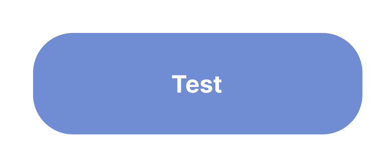
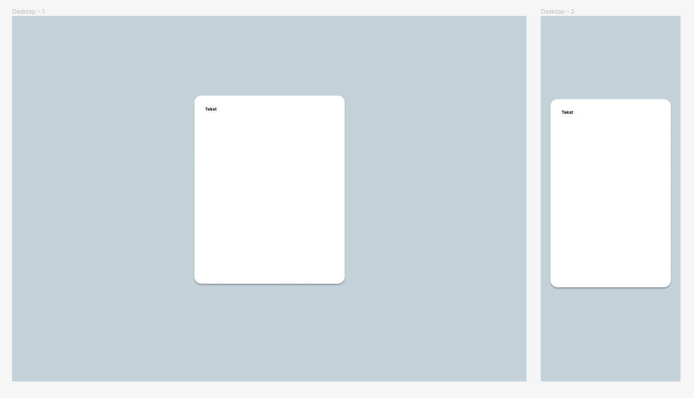
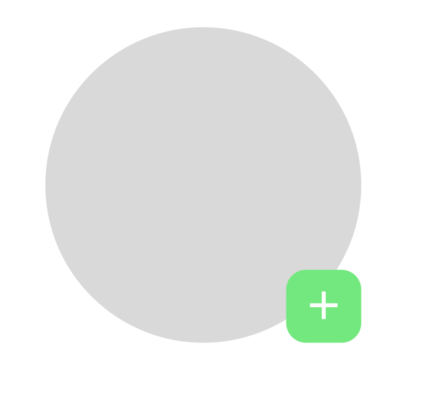

# Layout

Het meest vervelende aan CSS is dingen op de juiste plek zetten. Of het nou om een gewoon scherm gaat of over een scherm dat van grootte veranderd, niks staat op de juiste plek. Met een goede basis en kennis over wat je wanneer moet doen voor layout wordt dat gelukkig een stuk makkelijker, en wordt je website ook veel makkelijker om responsive te maken. En geloof me, je wilt niet responsiveness aan het einde met een slechte basis doen.

## Kern
In layouts wil je eigenlijk zo min mogelijk `width: px` en `height: px` gebruiken. In plaats daarvan gebruik je op een handige manier `padding` en `margin` samen met flexbox, en `width: 100%` met een `max-width`. Dit is super belangrijk om een goede en aanpasbare layout te maken.

Daarnaast is het handig om altijd het volgende in je CSS te zetten, om ervoor te zorgen dat je niet een pagina hebt die niet het hele scherm vult:

```css
* {
    margin: 0;
    padding: 0;
}
```

## Flexbox
Je hebt vast weleens `display: flex` voorbij zien komen. Goed weten hoe dit precies werkt is super belangrijk, want Flexbox is praktisch het meest handige middel dat er is in CSS-layouts. Standaard staan elementen heel statisch (`position: static`, de standaardwaarde voor position) recht onder elkaar. Door `display: flex` toe te voegen, wordt de positie van het element dynamisch & flexibel, en dit is super handig.

### Flex-direction (https://developer.mozilla.org/en-US/docs/Web/CSS/flex-direction)
Dat de positie dynamisch & flexibel is, betekent dat elementen 'slim' naast elkaar gezet worden. Wat je vast is opgevallen, is dat als je Flexbox aanzet, twee elementen die onder elkaar staan ineens naast elkaar komen te staan. Dit komt door de volgende standaardwaarde: `flex-direction: row`. Row, oftewel horizontaal, houdt in dat het element alle `child`-elementen horizontaal achter elkaar zet. Door `flex-direction: column` te gebruiken, zullen de elementen verticaal achter elkaar staan. (Tip: je kunt ook `row-reverse` en `column-reverse` gebruiken om de volgorde om te draaien, bijvoorbeeld handig voor responsiveness)

### Justify-content (https://developer.mozilla.org/en-US/docs/Web/CSS/justify-content)
De `justify-content` instelling bepaalt hoe elementen verdeeld worden over de beschikbare ruimte. Dit wordt in de richting van `flex-direction` gedaan. Als je dus `flex-direction: row` hebt en `justify-content: center`, zullen de elementen horizontaal in het midden gezet worden. De standaardwaarde is `justify-content: start`, en een andere handige is mogelijk `justify-content: space-between`, die zoveel mogelijk ruimte zet tussen de elementen. Zie de bovenstaande link voor alle opties

### Align-items (https://developer.mozilla.org/en-US/docs/Web/CSS/align-items)
Je wilt items natuurlijk niet alleen in één richting in het midden zetten. Om in de andere richting (dus als je `flex-direction: row` hebt verticaal) te centreren, gebruik je `align-items: center`.

## Margin
Een `margin` is de lege ruimte om een element. Deze krimpt niet, en is een goede manier om ervoor te zorgen dat er altijd bepaalde ruimte buiten een element is. Het is hier oke om pixels te gebruiken. `margin: 10px` voegt aan alle kanten `10px` ruimte toe, en je kunt ook `margin: verticaal horizontaal` gebruiken, net als `margin-left`, `margin-right`, `margin-top` en `margin-bottom`.

### Margin: auto
Met `margin: auto` kan je veel bereiken wat je met Flexbox ook kunt. `auto` probeert de maximale margin toe te voegen. Als je dus `margin-left: auto` doet, zal het links zoveel mogelijk margin toevoegen en zal het element helemaal rechts komen te staan. Als je `margin: 0 auto` gebruikt, zal het links en rechts maximale ruimte toevoegen, waardoor het element in het midden komt te staan.

## Padding
Padding is lege ruimte in een element. Waar `margin` aan de buitenkant ruimte overhoudt, zal `padding` juist aan de binnenkant een beetje ruimte toevoegen. Perfect als je een knop als dit wilt maken: 



Deze knop heeft altijd ruimte om de tekst heen, wat helpt met de leesbaarheid van de knop. In plaats van dat je hem `width` en `height` geeft, geef je hem `padding: verticaal horizontaal`.

## Max-width
Een super handig middel is `max-width`. De `max-width` is zoals de naam al zegt de maximale breedte dat een element kan krijgen. Door bijvoorbeeld `max-width: 500px` te doen gecombineerd met `width: 100%`, zal je element altijd proberen 500px breed te zijn, maar wordt hij kleiner zodra er niet genoeg ruimte is, zonder dat hij buiten het scherm gaat steken. In het voorbeeld zometeen zie je hoe dit handig is.

## Viewport height
Als je een element de breedte van je hele scherm wilt geven, dan gebruik je `width: 100%`. Dit werkt alleen niet met hoogte. Voor hoogte moet je `height: 100vh` gebruiken (percentage-zonder-procent-teken viewport-height). Dit maakt het element de hoogte van je scherm (je `viewport`).

# Voorbeeld
Hieronder staat een voorbeeld van een simpele layout voor een login-pagina.



De code hiervoor is vrij simpel (alleen CSS, het is standaard HTML met een `div` met daarin een `p` element):

```css
* {
    margin: 0;
    padding: 0;
}

body {
    width: 100%;
    height: 100vh;
    background-color: #C4D1D8;
    display: flex;
    justify-content: center;
    align-items: center;
}

.login-container {
    width: 100%;
    max-width: 400px;
    padding: 30px;
    margin: 30px;
    background-color: white;
    border-radius: 20px;
    height: 600px; /* Deze laat je normaal weg en laat je automatisch gevuld worden door de inhoud (dynamisch dus) */
}
```

Zoals je kunt zien is deze login-pagina responsive. Je kunt een simpele pagina al responsive maken met een goede layout, zonder dat je het document over responsiveness uberhaupt hebt hoeven lezen. Dat is hoe belangrijk een goede layout is.

## Position: absolute (en relative)
`position: absolute` moet je alleen gebruiken als je een element bovenop een ander element wilt plaatsen, zoals in dit voorbeeld (een profielfoto met een volg knop eroverheen):



De volgknop staat bovenop de profielfoto (een div met een background-image en een hoge border-radius zodat hij rond wordt), en krijgt dus `position: absolute`. Omdat we willen dat hij bovenop de profielfoto staat, geven we de profielfoto `position: relative`. 

Als je dit toe zou voegen, zou het element linksboven staan. Je kunt met `top`, `left`, `bottom` en `right` de positie bepalen. Door `right: 0px` en `bottom: 0px` toe te voegen, komt het element rechtsonderin te staan. Je wilt bij deze properties meestal voornamelijk `0px` of een percentage gebruiken. Probeer NOOIT op deze manier iets in het midden te zetten. Je kunt wel een kleine hoeveelheid pixels gebruiken als een soort nep-padding.

## Position: fixed
`position: fixed` lijkt heel veel op `position: absolute`, maar neemt in plaats van het eerste parent-element met `position: relative` het scherm, en staat dus altijd op een vaste positie op het scherm, ook als je scrolled. Deze wil je gebruiken voor iets als een search-bar die altijd bovenin het scherm staat, of van die support-chats die rechtsonderin een pagina staan.